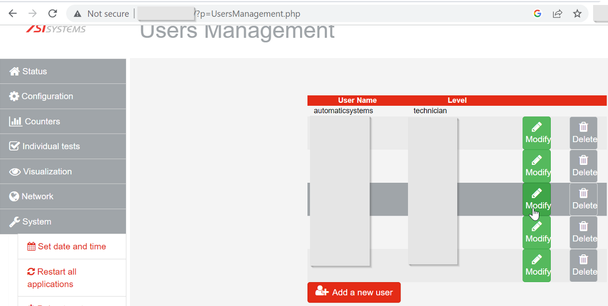

# Automatic-Systems SOC FL9600 FastLine - The device contains hardcoded login and password for super admin
Date: 12/9/2023\
Remote: yes\
Local: No\
Exploit Author: Mike Jankowski-Lorek, Marcin Kozlowski, Paula Januszkiewicz and CQURE Team\
Vendor Homepage: http://automatic-systems.com\
CVE : CVE-2023-37608\
Version: Automatic-Systems SOC FL9600 FastLine version:V06\
Tested on: VersionSVN = 28569_8a99acbd8d7ea09a57d5fbcb435da5427b3f6b8a, DateCompil = 2019-11-20 11:22:18

## POC
An issue in Automatic Systems SOC FL9600 FastLine version:V06 a remote attacker to obtain sensitive information via the admin login credentials.

The device contains hardcoded login and password for super admin. The administrator cannot change the password for this account.
```
Login: automaticsystems
Password: astech
```



[def]: poc1.png
